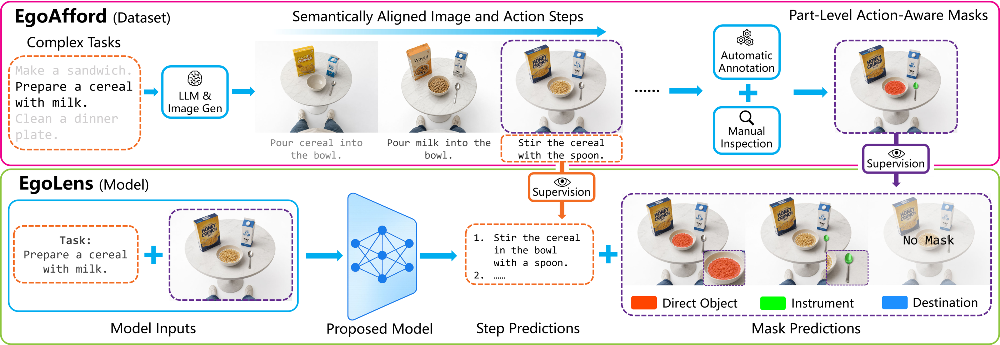
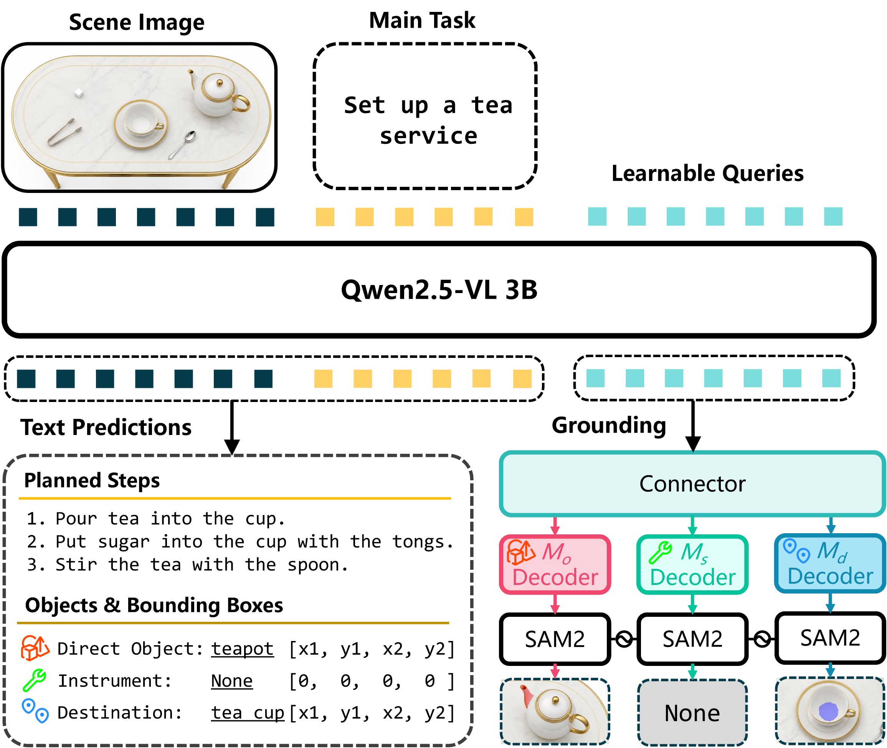
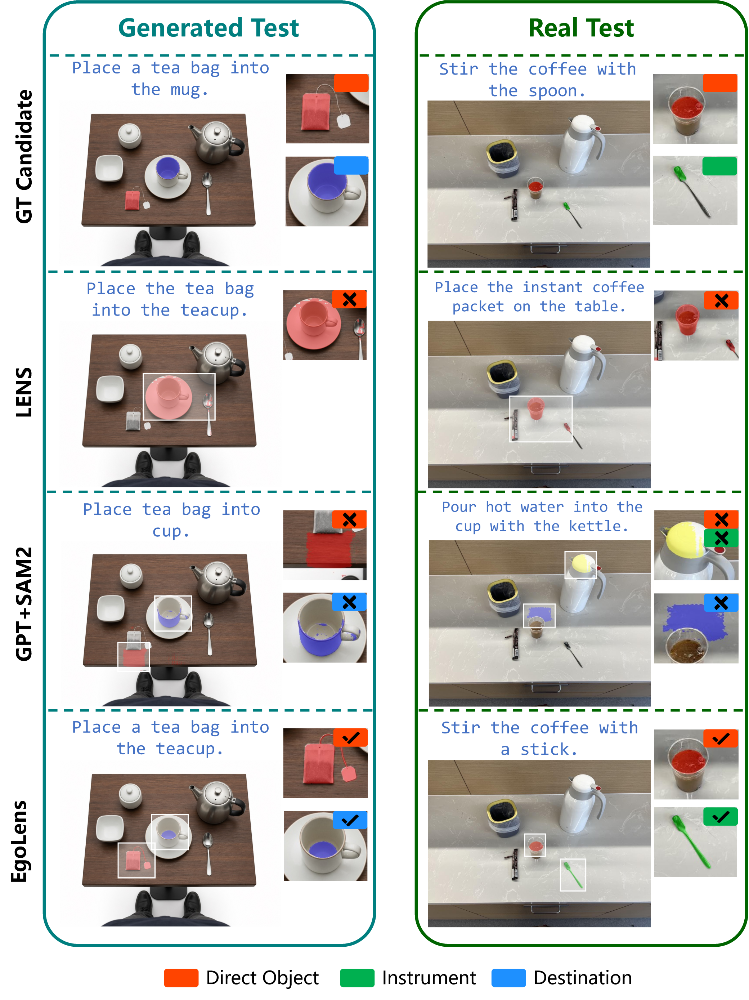

<div align="center">

<h1 align="center">
   EgoLens
</h1>

### Official model implementation of
### *EgoAfford: Task-Oriented Affordance Grounding via Egocentric Referring Segmentation*

Xinyuan Guan<sup>1,2</sup>, Feifan Chen<sup>1</sup>, Xinyu Zhan<sup>1</sup>, Fu-Cheng Zhang<sup>2</sup>, Cewu Lu<sup>1,2,3</sup>, Lixin Yang<sup>1,2,*</sup>

<sup>1</sup> Shanghai Jiao Tong University &nbsp;&nbsp; <sup>2</sup> Shanghai Innovation Institute &nbsp;&nbsp; <sup>3</sup> Noematrix Ltd

<sup>*</sup> Corresponding author

[](https://arxiv.org/abs/2608.04533)
[](https://egoafford.github.io/)
[](https://huggingface.co/datasets/Pantheonmonilaum/EgoAfford)
[](https://huggingface.co/Pantheonmonilaum/EgoLens)
[](LICENSE)

</div>

<p align="center">
  
</p>

## 📢 News

- **August 2026** Paper released on [arXiv](https://arxiv.org/abs/2608.04533).

## 📖 Overview

**EgoAfford** is a benchmark for task-oriented affordance grounding in multi-step tabletop tasks. Given an egocentric observation and a high-level task, a model must:

1. generate the remaining action plan; and
2. segment the functional regions of up to three components of the immediate next action:
   - **Direct object**: the object being manipulated;
   - **Instrument**: the object used to act on the direct object;
   - **Destination**: the target receiving the object or transferred material.

Each component is grounded at the **part level**, such as the blade of a knife or the spout of a pot. Instruments and destinations may be absent, in which case their masks are empty.

**EgoLens** is a 3B multimodal reference model that jointly generates the remaining plan and predicts three role-specific masks in a single forward pass. It combines a Qwen2.5-VL-3B backbone with learnable grounding queries, role-specific prompt decoders, and SAM2.

## ✨ Highlights

- **Task-oriented formulation** connecting task progress, multi-step planning, and part-level grounding.
- **Three action roles** explicitly modeled as direct object, instrument, and destination.
- **Semantically aligned observations** depicting the scene state before each action step.
- **Multi-reference evaluation** supporting multiple admissible next actions.
- **Generated and real test sets** for evaluating in-domain performance and zero-shot transfer.
- **Joint prediction** of natural-language plans and role-specific segmentation masks.

## 📦 EgoAfford at a Glance

| Split | Tasks / scenes | Images | Mean steps | Multi-next-step states | Mean candidates |
|---|---:|---:|---:|---:|---:|
| Train | 1,900 scenes | 15,049 | 7.92 | - | - |
| Test | 100 scenes | 488 | 4.88 | 44.9% | 1.85 |
| EgoAfford-Real | 26 tasks | 102 | 3.92 | 48.0% | 1.89 |

The generated corpus contains **15,537 human-verified images from 2,000 scenes**, covering 4,123 object names and 391 verbs before semantic clustering. EgoAfford-Real contains 102 manually captured observations and is used only for zero-shot evaluation.

## 🧠 Model Architecture

<p align="center">
  
</p>

EgoLens is built on the LENS query-based segmentation architecture:

- the **Qwen2.5-VL-3B** backbone processes the scene image, task prompt, generated text, and learnable grounding queries;
- the model autoregressively generates a planning trace and a structured answer;
- three independent decoder branches bind the grounding queries to the direct-object, instrument, and destination roles;
- each branch produces SAM2 prompt embeddings for part-level mask prediction.

Training uses supervised learning with a joint language-and-segmentation objective. The language loss supervises tokens in the structured answer, while the reference planning trace is teacher-forced as a semantic prefix. Non-empty masks use BCE and Dice losses; empty masks use BCE only.

## 🛠️ Installation

The released code was validated with Python 3.11, PyTorch 2.5.1, and CUDA 12.4 on Linux. An NVIDIA GPU and a working CUDA toolkit are required to build FlashAttention and the SAM2 extension.

### 1. Create the environment

```bash
conda create -n egolens python=3.11 -y
conda activate egolens

python -m pip install --upgrade pip setuptools wheel ninja packaging
```

### 2. Install PyTorch

Install the tested CUDA 12.4 build of PyTorch:

```bash
python -m pip install \
  torch==2.5.1 torchvision==0.20.1 \
  --index-url https://download.pytorch.org/whl/cu124
```

For a different CUDA environment, install a compatible PyTorch build and verify it before continuing.

### 3. Install the core dependencies

```bash
python -m pip install -r requirements.txt
```

Install FlashAttention after PyTorch so that it builds against the active CUDA-enabled PyTorch installation:

```bash
MAX_JOBS=8 python -m pip install \
  flash-attn==2.7.0.post2 \
  --no-build-isolation
```

### 4. Build the SAM2 CUDA extension

```bash
pushd src/segment_anything_2
python setup.py build_ext --inplace
popd
```

You may set `TORCH_CUDA_ARCH_LIST` according to your GPU before this step.

### 5. Install optional diagnostic dependencies

The commercial-VLM pipelines and S3-compatible image loading utilities require additional packages:

```bash
python -m pip install -r requirements-optional.txt
```

### 6. Verify the installation

```bash
python -m pip check

python -c "import torch, transformers, accelerate, deepspeed, trl; \
print('torch:', torch.__version__); \
print('CUDA:', torch.version.cuda); \
print('CUDA available:', torch.cuda.is_available())"
```

## 📥 Data and Checkpoints

Download the [EgoAfford dataset](https://huggingface.co/datasets/Pantheonmonilaum/EgoAfford), [EgoLens checkpoints](https://huggingface.co/Pantheonmonilaum/EgoLens), and the official [Qwen2.5-VL 3B](https://huggingface.co/Qwen/Qwen2.5-VL-3B-Instruct), then organize the resources as follows:

```text
EgoLens/
├── pretrained/
│   ├── Qwen/
│   │   └── Qwen2.5-VL-3B-Instruct/
│   ├── EgoLens/
│   └── sam2_hiera_large.pt
├── data/
│   ├── EgoAfford/
│   └── EgoAfford_real/
└── ...
```

The generated train and test splits share one root directory. The split is determined by the numeric scene ID: `scene_1` through `scene_100` form the test set, while `scene_101` through `scene_2000` form the training set.

### Training scenes

```text
EgoAfford/
├── invalid.json
├── scene_101/
│   ├── task.json
│   ├── obj_meta.json
│   ├── masks.npz
│   ├── step_constraints.json
│   ├── step_0.png
│   ├── step_1.png
│   └── ...
├── scene_102/
└── ...
```

Each training scene contains the high-level task and reference action sequence in `task.json`, role metadata in `obj_meta.json`, sparse three-channel masks in `masks.npz`, action-order constraints in `step_constraints.json`, and one observation image for each action state. The mask channels follow the direct-object, instrument, and destination order.

### Test scenes

```text
EgoAfford/
├── invalid.json
├── scene_1/
│   ├── task.json
│   ├── obj_meta.json
│   ├── masks.npz
│   ├── step_constraints.json
│   ├── alternatives.json
│   ├── masks_multi.npz
│   ├── masks_multi_index.json
│   ├── step_0.png
│   ├── step_1.png
│   └── ...
├── scene_2/
└── ...
```

Test scenes retain the single-reference annotations used by the training format and add multi-reference for evaluation. `alternatives.json` records admissible next actions, `masks_multi.npz` stores their corresponding role masks, and `masks_multi_index.json` maps each state-action candidate to its mask entry. These three files are required for the official multi-reference evaluation.

### Real Test scenes

```text
EgoAfford_real/
├── scene_1/
│   ├── task.json
│   ├── step_constraints.json
│   ├── alternatives.json
│   ├── masks_multi.npz
│   ├── masks_multi_index.json
│   ├── step_0.png
│   ├── step_1.png
│   └── ...
├── scene_2/
└── ...
```

Real test scenes have largely the same structure with the test set, but missing the `obj_meta.json` and `masks.npz`. These files do not affect the evaluation.

## 🚀 Training

We provide scripts for the full task and the segmentation-only diagnostic:

```bash
# Full EgoLens: remaining-plan generation and component grounding
bash train_qwen2p5_3b_full.sh

# EgoLens-Seg: component grounding from a provided action step
bash train_qwen2p5_3b_seg.sh
```

Before launching training, set the dataset path, backbone path, output directory, GPU count, and distributed-training variables in the scripts. The dataset must be supplied through `--image_dir`.

The paper configuration uses:

| Setting | Value |
|---|---:|
| Backbone | Qwen2.5-VL-3B |
| Segmenter | SAM2-Hiera-Large |
| Epochs | 40 |
| Optimizer | AdamW |
| Learning rate | 3e-5 |
| Per-device batch size | 16 |
| Gradient accumulation | 4 |
| GPUs | 8 NVIDIA H200 |
| Approximate training time | 12 hours |

## 🧪 Evaluation

### Full task

Set the model checkpoint, dataset path, and GPU count in [`eval_full.sh`](eval_full.sh), then run the script from the repository root.

### Segmentation-only diagnostic

Set the Seg checkpoint, dataset path, GPU count, and input type in [`eval_seg.sh`](eval_seg.sh), then run the script from the repository root. Use `gt` for the reference next action or a VLM backend name for the corresponding prediction file described below.

### VLM-SAM2 baselines and EgoLens-Seg

The utilities in `llm/` support a two-stage VLM-SAM2 baseline. A VLM first predicts point and bounding-box prompts for the three functional roles, and SAM2 converts these spatial prompts into masks. The standard `all` setting also predicts the remaining action plan. Please refer to the paper for the detailed settings.

Install the optional dependencies as described above, configure the API endpoint and key expected by `llm/llm.py`, and set the same EgoAfford root in the selected VLM script and `sam2_segmentation.py`. These utilities use the generated test split only (`scene_1` through `scene_100`) and sort scenes by numeric ID so that their sample indices remain aligned.

Run the utilities from the `llm` directory so that their relative output paths are preserved. Add the repository, bundled SAM2 package, and evaluation utilities to `PYTHONPATH` before launching SAM2 segmentation:

```bash
cd llm

export API_URL="YOUR_OPENAI_COMPATIBLE_ENDPOINT"
export API_KEY="YOUR_API_KEY"
export PYTHONPATH="$(pwd)/..:$(pwd)/../src/segment_anything_2:$(pwd)/../eval:${PYTHONPATH}"

python vlm_inference.py --type gpt
```

Replace `gpt` with another backend implemented in `llm/llm.py` when needed, and use the same value in all downstream commands. The `--task` value passed to `sam2_segmentation.py` must match the VLM inference script:

| SAM2 task | VLM inference script | VLM output | Prompt setting |
|---|---|---|---|
| `all` | `vlm_inference.py` | `vlm_output/<type>.json` | Predict the remaining plan and spatial prompts from the goal and image. |
| `mask` | `vlm_inference_mask.py` | `vlm_output/<type>_mask.json` | Predict spatial prompts with the reference current action provided. |
| `hard` | `vlm_inference_mask_hard.py` | `vlm_output/<type>_mask_hard.json` | Infer the next action internally and output only its spatial prompts. |

For example, the three matched workflows are:

```bash
python vlm_inference.py --type gpt
python sam2_segmentation.py --type gpt --task all --vis

python vlm_inference_mask.py --type gpt
python sam2_segmentation.py --type gpt --task mask --vis

python vlm_inference_mask_hard.py --type gpt
python sam2_segmentation.py --type gpt --task hard --vis
```

Before running `sam2_segmentation.py`, set its EgoAfford path and SAM2 checkpoint path. Metrics and optional visualizations are saved under `llm/seg_output/`.

The output of `vlm_inference.py` can also provide predicted next-step text to **EgoLens-Seg**. Set the matching backend type in `eval_seg.sh` and run that script from the repository root. EgoLens-Seg reads `steps[0]` from `llm/vlm_output/<type>.json` as its action condition and predicts the masks with the learned EgoLens segmentation branches. The `mask` and `hard` outputs contain no explicit plan and therefore are not inputs to EgoLens-Seg. The model does not consume masks from `llm/seg_output/`; VLM-SAM2 and EgoLens-Seg are alternative grounding routes. Use `gt` in `eval_seg.sh` to condition EgoLens-Seg on the reference next action.

### Metrics

- **gIoU**: mean per-mask IoU, including correct empty-mask predictions.
- **cIoU**: globally accumulated pixel intersection divided by union.
- **First-Step Similarity**: semantic similarity of the predicted and admissible next steps.
- **Semantic F1**: one-to-one semantic matching between predicted and reference plans.
- **CSR**: satisfaction ratio of annotated precedence constraints.
- **Coverage**: semantic recall over the reference remaining plan.

## 📊 Main Results

### Full task on the generated EgoAfford test set

| Method | gIoU | cIoU | First-Step Sim. | Semantic F1 | CSR | Coverage |
|---|---:|---:|---:|---:|---:|---:|
| **EgoLens** | **0.700** | **0.486** | 0.666 | 0.500 | **0.624** | **0.566** |

### Zero-shot evaluation on EgoAfford-Real

| Method | gIoU | cIoU | First-Step Sim. | Semantic F1 | CSR | Coverage |
|---|---:|---:|---:|---:|---:|---:|
| **EgoLens** | **0.666** | **0.455** | **0.631** | 0.426 | **0.609** | **0.481** |

### Segmentation with a reference next step

| Method | gIoU | cIoU |
|---|---:|---:|
| **EgoLens-Seg** | **0.839** | **0.668** |

<p align="center">
  
</p>

## 🗂️ Repository Structure

```text
EgoLens/
├── visualizer/
│   ├── dataset_visualizer.py       # Dataset visualizer
│   └── README.md                   # Visualizer setup and controls
├── assets/                         # README figures
├── configs/                        # DeepSpeed configurations
├── eval/                           # Metrics and distributed evaluation
├── llm/                            # VLM and VLM-SAM2 diagnostic pipelines
├── scripts/
│   └── prepare_release_dataset.py  # Dataset release preparation
├── src/
│   ├── open_r1/                    # Data loading, model, and training code
│   └── segment_anything_2/         # SAM2 implementation and configurations
├── requirements.txt                # Core dependencies
├── requirements-optional.txt       # VLM API and S3 utilities
├── train_qwen2p5_3b_full.sh        # Full-task training
├── train_qwen2p5_3b_seg.sh         # Segmentation-only training
├── eval_full.sh                    # Full-task evaluation
├── eval_seg.sh                     # Segmentation-only evaluation
└── LICENSE
```

## 📝 Citation

If you find EgoAfford or EgoLens useful, please cite:

```bibtex
@article{guan2026egoafford,
  title   = {EgoAfford: Task-Oriented Affordance Grounding via Egocentric Referring Segmentation},
  author  = {Guan, Xinyuan and Chen, Feifan and Zhan, Xinyu and Zhang, Fu-Cheng and Lu, Cewu and Yang, Lixin},
  journal = {arXiv preprint arXiv:2608.04533},
  year    = {2026},
  url     = {https://arxiv.org/abs/2608.04533}
}
```

## 🙏 Acknowledgements

EgoLens builds on Qwen2.5-VL, SAM2, and LENS. We thank the authors and maintainers of these projects for making their work available to the community.

## 📜 License

This repository is released under the [Apache License 2.0](LICENSE). Third-party components and checkpoints remain subject to their respective licenses.
